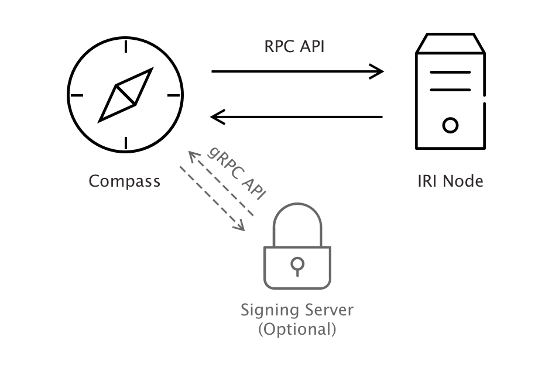

# Create a permissioned network

**If you want to test your application in a permissioned IOTA network, you can run Compass. A permissioned IOTA network is one in which IRI nodes must gain permission before joining an IOTA network. All IRI nodes in a permissioned network must be set up to recognize Compass transactions as trusted milestones.**

For this basic setup, you'll install both the IRI node and Compass on the same server or virtual machine. You can also install an optional signing server for increased security.

A signing server reduces the attack surface of Compass by moving sensitive operations to an external service. Compass interacts with the signing server through gRPC.



To create a permissioned IOTA network, you must complete the following tasks in order:

1. [Install the dependencies](#install-the-dependencies)
2. [Calculate the Merkle tree](#calculate-the-merkle-tree)
3. [Run an IRI node](#run-an-iri-node)
4. [Run Compass](#run-compass)
5. [Test the network](#test-your-network)

## Prerequisites

To complete these tasks, your computer will need the following:

* A new installation of an Ubuntu 18.04 Server / Virtual Machine
* At least 8GB RAM
* Preferably 4+ CPU cores, the more cores the faster the Merkle tree will be generated.
* At least a 10GB SSD

## Install the dependencies

Compass uses [Bazel](https://bazel.build/) to build and [Docker](https://www.docker.com/) to run, so we need to make sure both are installed.
1. Install the dependencies for Bazel
	```bash
	$ sudo apt-get install pkg-config zip g++ zlib1g-dev unzip python
	```

2. Download the latest Bazel installer
	```bash
	$ wget https://github.com/bazelbuild/bazel/releases/download/0.18.0/bazel-0.18.0-installer-linux-x86_64.sh
	```

3. Check that you can execute the script before you run it
	```bash
	$ chmod +x bazel-0.18.0-installer-linux-x86_64.sh
	```

4. Install Bazel under your active user, using the `--user` flag
	```bash
	$ ./bazel-0.18.0-installer-linux-x86_64.sh --user
	```

5. Install Docker
	```bash
	$ sudo apt install apt-transport-https ca-certificates curl software-properties-common
	$ curl -fsSL https://download.docker.com/linux/ubuntu/gpg | sudo apt-key add -
	$ sudo add-apt-repository "deb [arch=amd64] https://download.docker.com/linux/ubuntu bionic stable"
	$ sudo apt update
	$ sudo apt install docker-ce
	```
6. Install the `jq` tool for formatting JSON data
	```bash
	$ sudo add-apt-repository universe
	$ sudo apt install jq
	```

## Calculate the Merkle tree

For this guide, we use a [Merkle tree](concepts/about-compass.md#merkle-tree-generation) with a depth of 16, which allows us to run compass for 45 days in a row at 1-minute-milestone intervals.

The Compass repository includes a tool to generate a Merkle tree and save it in a data folder for Compass to use later on. 

1. Clone the Compass GitHub repository
	```bash
	$ git clone https://github.com/iotaledger/compass.git
	$ cd compass
	```
2. Build the layers_calculator tool that will generate the Merkle tree
	```bash
	$ bazel run //docker:layers_calculator
	```
3. Generate a seed for Compass:
	```bash
	$ cat /dev/urandom |LC_ALL=C tr -dc 'A-Z9' | fold -w 81 | head -n 1 
	```

4. Create a backup of the seed

5. Change into the directory that contains the scripts for setting up and running Compass
	```bash
	$ cd docs/private_tangle
	```

6. Copy the example configuration file
	```bash
	$ cp config.example.json config.json
	```
7. Open the `config.json` file and replace the value of the `seed` field with the seed you generated in step 3
	```bash
	$ nano config.json
	```

8. Change the value of the `depth` field to `16`

	The finished `config.json` should look like this:
	```json
	{
		"seed": "MYSEEDHEREPLEASEREPLACEMEIMMEDIATELYWITHSOMETHINGSECURE99999999999999999999999999",
		"powMode": "CURLP81",
		"sigMode": "CURLP27",
		"security": 1,
		"depth": 16,
		"milestoneStart": 0,
		"mwm": 9,
		"tick": 60000,
		"host": "http://localhost:14265"
	}
	```

9. Make sure Docker is aware of the layers_calculator image
	```bash
	$ sudo ../../bazel-bin/docker/layers_calculator
	```

10. Generate the Merkle tree by executing the script in the docs/private_tangle directory:
	```bash
	$ sudo ./01_calculate_layers.sh
	```
This process will take a while (with a 4 core virtual machine it takes around 15 minutes). After the process finishes, the root of the Merkle tree is output to the console:

```shell
[main] INFO org.iota.compass.LayersCalculator - Calculating 65536 addresses.
...
[main] INFO org.iota.compass.LayersCalculator - Successfully wrote Merkle Tree with root: JMRTYHMGNZGNOLPSSBVLWRPMGIAMOXPLURNDIBKXIFTCJCLOYKH9FMVNKPBVFVMGSUFEYVUUIEARFQXAK
```

The Merkle tree is stored in the data directory, so Compass can use it when it starts running.

## Run an IRI node

Compass must send milestones to an IRI Node. Compass sends milestones to an IRI node through an HTTP RPC API on the default `14265` port or on whichever port is passed during initialization.

To make running the IRI easier, we created a script that uses the default IRI Docker container with some additional parameters.

The IRI node works with a snapshot file to set the initial state of the ledger.

To keep things simple, put the total IOTA supply of 2.7Pi in the first address that's generated by the following client seed:
`SEED99999999999999999999999999999999999999999999999999999999999999999999999999999`.

The first address is  `FJHSSHBZTAKQNDTIKJYCZBOZDGSZANCZSWCNWUOCZXFADNOQSYAHEJPXRLOVPNOQFQXXGEGVDGICLMOXX` (excluding the checksum). 

1. Open a new file called `snapshot.txt` in an editor
	```bash
	$ nano snapshot.txt
	```

2. Add the following line, which puts 2.7Pi into the address on the left of the semicolon:
	```shell
	FJHSSHBZTAKQNDTIKJYCZBOZDGSZANCZSWCNWUOCZXFADNOQSYAHEJPXRLOVPNOQFQXXGEGVDGICLMOXX;2779530283277761
	```

**Note:** Do not exceed the maximum supply of 2.7Pi.

3. Run the IRI
	```bash
	$ sudo ./02_run_iri.sh
	```
Use `CTRL+C` in the console to go back to your shell session, and IRI will continue to run in the background.

## Run Compass

After you've generated the Merkle tree and you're running an IRI node, you can run Compass.

1. Go back to your compass directory and run bazel
	```bash
	$ cd ~/compass/
	$ bazel run //docker:coordinator
	```

2. Run the Docker container
	```bash
	$ sudo ../../bazel-bin/docker/coordinator
	```

3. Run Compass
	```bash
	$ sudo ./03_run_coordinator.sh -bootstrap -broadcast
	```

Compass is sending milestones :tada:

**Note:** Compass will stop sending milestones if the Merkle tree runs out of branches. To avoid this problem, use an appropriate value for the `depth` field of the Merkle tree configuration file.

## Test your network

You can connect to your IRI node on port 14265, using Trinity or a client library.

1. Connect to your IRI node
2. Enter the `SEED99999999999999999999999999999999999999999999999999999999999999999999999999999` seed

Your balance should be 2.7Pi (you might have to attach the first address, depending on what client library you use).

Feel free to send test transactions and see them confirmed by Compass milestones.