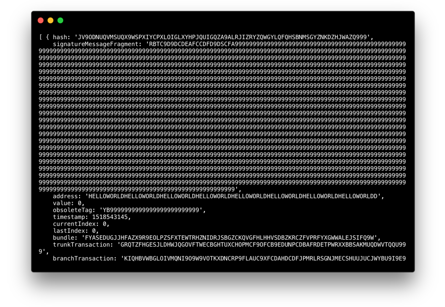

# Send your first data transaction (Node.js)

**In this tutorial, you'll use the IOTA JavaScript client library to create a program that sends data transactions on the IOTA Devnet network.**

**Note:** Sending a value transaction is similar to sending a data transaction, but it requires an address that contains IOTA tokens.

## Prerequisites

To complete this tutorial, you need the following:

* [Node.js 8+](https://nodejs.org/en/)
* [Node Package Manager](https://www.npmjs.com/) (npm)
* A code editor
* Access to a terminal
* An Internet connection

<hr>

In IOTA, transactions must be sent to [IRI nodes](iri/introduction/overview.md).

If you know the URL of an IRI node, you can send it a transaction. In this example we use the URL of an IRI node on the IOTA Devnet network and use the [`getNodeInfo()` method](https://github.com/iotaledger/iota.js/blob/next/api_reference.md#module_core.getNodeInfo) to check that the IRI node is online.

1. In the terminal, create a working directory called iota-example:
    ```bash
    mkdir iota-example && cd iota-example
    ```

2. Change into the iota-example directory and use npm to install the required Node.js libraries:
    ```bash
    cd iota-example
    npm install @iota/core @iota/converter --save
    ```

    You now have a package.json file and a node_modules folder in your working directory.

3. In the iota-example directory, create a new file called index.js and add the following code to it:

    ```js
    // Require the IOTA libraries
    const Iota = require('@iota/core');
    const Converter = require('@iota/converter');
    // Create a new instance of the IOTA object
    // Use the `provider` field to specify which IRI node to connect to
    const iota = Iota.composeAPI({
    provider: 'https://nodes.devnet.iota.org:443'
    });
    // Call the `getNodeInfo()` method for information about the IRI node
    iota.getNodeInfo()
    // Convert the returned object to JSON to make the output more readable
    .then(info => console.log(JSON.stringify(info)))
    .catch(err => {
        // Catch any errors
        console.log(err);
    });
    ```

4. Save the file and run the code by using this command in the terminal:

    ```bash
    node index.js
    ```

Some information about the IRI node that you're connected to is displayed in the console:

```json
{
"appName":"IRI Testnet",
"appVersion":"1.5.5",
"jreAvailableProcessors":8,
"jreFreeMemory":25013138032,
"jreVersion":"1.8.0_181",
"jreMaxMemory":51469877248,
"jreTotalMemory":31622422528,"latestMilestone":"WB9YXQQTVHNPWXHBCVEWVPWZNJAFSGPVYWPEJXVPGJIFJFFHLFAIFPAWEHJGKEIHMYAUHXOPIUGZOA999",
"latestMilestoneIndex":1014730,"latestSolidSubtangleMilestone":"WB9YXQQTVHNPWXHBCVEWVPWZNJAFSGPVYWPEJXVPGJIFJFFHLFAIFPAWEHJGKEIHMYAUHXOPIUGZOA999",
"latestSolidSubtangleMilestoneIndex":1014730,
"milestoneStartIndex":434525,
"neighbors":7,
"packetsQueueSize":0,
"time":1545903340781,
"tips":4995,
"transactionsToRequest":0,
"features":["addNeighbors", "getNeighbors", "removeNeighbors", "attachToTangle", "interruptAttachToTangle"],
"duration":0
}
```

Now that you've confirmed your connection to an IRI node, send a transaction to it.

5. At the end of the index.js file, add the following code
    ```js
    const address =
    'HELLOWORLDHELLOWORLDHELLOWORLDHELLOWORLDHELLOWORLDHELLOWORLDHELLOWORLDHELLOWORLDD'
    const seed =
    'PUEOTSEITFEVEWCWBTSIZM9NKRGJEIMXTULBACGFRQK9IMGICLBKW9TTEVSDQMGWKBXPVCBMMCXWMNPDX'
    const message = Converter.toTrytes('Hello World!')

    const transfers = [
    {
        value: 0,
        address: address,
        message: message
    }
    ]

    iota.prepareTransfers(seed, transfers)
        .then(trytes => {
            return iota.sendTrytes(trytes, 3, 9)
        })
        .then(bundle => {
        console.log(`Published transaction with tail hash: ${bundle[0].hash}`)
        console.log(`Bundle: ${bundle}`)
    })
    .catch(err => {
            // Catch any errors
        console.log(err);
    });
    ```

    Lets break this code down:

    **Set up the variables**

    ```javascript
    const address =
    'HELLOWORLDHELLOWORLDHELLOWORLDHELLOWORLDHELLOWORLDHELLOWORLDHELLOWORLDHELLOWORLDD'
    const seed =
    'PUEOTSEITFEVEWCWBTSIZM9NKRGJEIMXTULBACGFRQK9IMGICLBKW9TTEVSDQMGWKBXPVCBMMCXWMNPDX'
    const message = Converter.asciiToTrytes('Hello World!')
    ```

    The `address` and `message` constants are used in the `transfers` object that's passed to the [`prepareTransfer`] method(https://github.com/iotaledger/iota.js/blob/next/api_reference.md#module_core.prepareTransfers).

    The value of the `message` constant is converted to trytes because IOTA networks accept only tryte-encoded messages.
    The value of the `address` constant is the address that the message is sent to.
    The value of the `seed` constant is the seed that is used to generate an address to send the message from.

    **Note:** Seeds and address must both contain 81 tryte-encoded characters. If a seed consists of less than 81 characters, the library will append 9s to the end of it to make 81 characters. 

    **Create the transfers array for the transaction**

    ```javascript
    const transfers = [
    {
        value: 0,
        address: address,
        message: message
    }
    ]
    ```

    The `transfers` array lets you specify transfers you want to make from
    an address that is generated from your seed. In this case, you send a transfer with no value to an address and you include the tryte-encoded message 'Hello World!'.

    **Prepare and send the transfer**

    ```javascript
     iota.prepareTransfers(seed, transfers)
        .then(trytes => {
            return iota.sendTrytes(trytes, 3/*depth*/, 9 /*mwm*/)
        })
        .then(bundle => {
        console.log(`Published transaction with tail hash: ${bundle[0].hash}`)
        console.log(`Bundle: ${bundle}`)
    })
    .catch(err => {
            // Catch any errors
        console.log(err);
    });
    ```

    The [`prepareTransfers` method](https://github.com/iotaledger/iota.js/blob/next/api_reference.md#module_core.prepareTransfers) constructs a transaction on the client side. The [`sendTrytes` method](https://github.com/iotaledger/iota.js/blob/next/api_reference.md#module_core.sendTrytes) sends the transaction to the IRI node.

    Here's a table of the variables that are used in these methods:

    |Field|Type|Description|
    |:---:|:--:|:---------:|
    |`seed` | string|This is the secret password that generates an address for you to send a transaction from. With **zero** value transactions we do not need to have any tokens on an address, so this field can be 81 random trytes. |
    |`depth` | number|The number of milestone transactions that the IRI node will walk back to start the [tip selection](iri/concepts/tip-selection.md) process |
    |`mwm` |number | This field specifies the proof of work that is required for your transaction to be validated. On the Devnet, this field must have a value of at least 9|
    | `transfers`| array|This array contains the value, address and message of your transaction. You can specify multiple transactions to different addresses |

## Final Code

The contents of the index.js file should look like this:

```js
// Require the IOTA libraries
const Iota = require('@iota/core');
const Converter = require('@iota/converter');
// Create a new instance of the IOTA object
// Use the `provider` field to specify which IRI node to connect to
const iota = Iota.composeAPI({
provider: 'https://nodes.devnet.iota.org:443'
});
// Call the `getNodeInfo()` method for information about the IRI node
iota.getNodeInfo()
    // Convert the returned object to JSON to make the output more readable
    .then(info => console.log(JSON.stringify(info)))
    .catch(err => {
        // Catch any errors
        console.log(err);
    });
const address = 'HELLOWORLDHELLOWORLDHELLOWORLDHELLOWORLDHELLOWORLDHELLOWORLDHELLOWORLDHELLOWORLDD'
const seed = 'PUEOTSEITFEVEWCWBTSIZM9NKRGJEIMXTULBACGFRQK9IMGICLBKW9TTEVSDQMGWKBXPVCBMMCXWMNPDX'
const message = Converter.asciiToTrytes('Hello World!')
const transfers = [
    {
    value: 0,
    address: address,
    message: message
    }
]
 iota.prepareTransfers(seed, transfers)
    .then(trytes => {
        return iota.sendTrytes(trytes, 3, 9)
    })
    .then(bundle => {
    console.log(`Published transaction with tail hash: ${bundle[0].hash}`)
    console.log(`Bundle: ${bundle}`)
})
.catch(err => {
        // Catch any errors
    console.log(err);
});
```

If you run this code, you'll see information about the IRI node and the transaction that you've just sent:



Congratulations 🎊. You've just sent your first data transaction.

Your transaction will propgate through the IOTA network until all the IRI nodes have it in their ledgers.

To confirm that your transaction in on the network, copy the `bundle` value from the console output, open a [Devnet Tangle explorer](https://devnet.thetangle.org/), and paste the value into the search bar.

**Note:** Data transaction don't need to be confirmed, only value transactions do.

## Next steps

Why not [run your own IRI node](tutorials/run-your-own-iri-node.md)?.