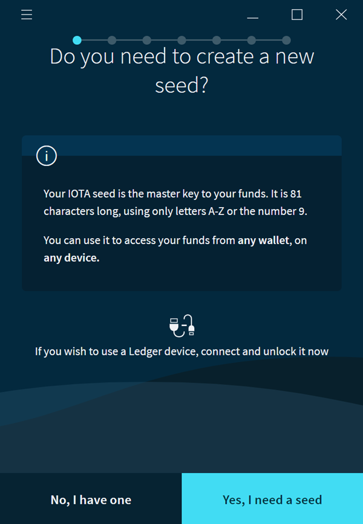
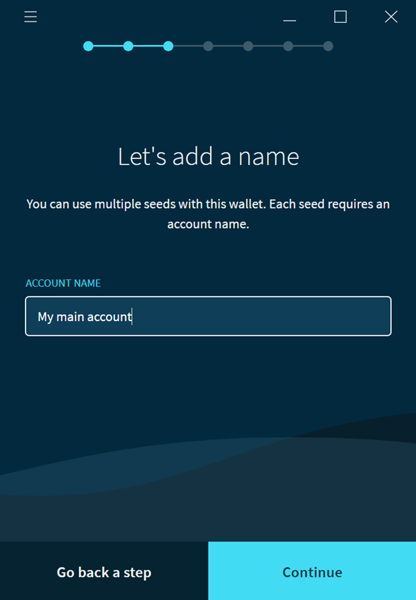
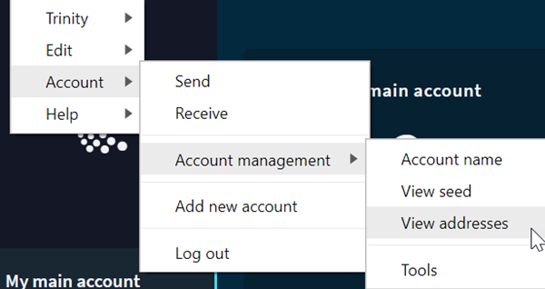
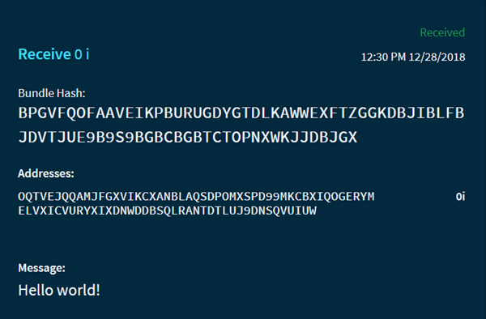

# Send your first data transaction (Trinity)

**Trinity is a mobile and desktop application with a user interface that allows you to transfer data and value in an IOTA network.**

Trinity allows you to do the following:
* Create a password-protected account to store and access your seeds
* Read your balance and transaction history
* Send and receive transactions on the [IOTA Mainnet network](references/iota-networks.md)

In this tutorial, you'll use Trinity to send yourself a data transaction, which is one that does not transfer value.

**Note:** Sending a value transaction is similar to sending a data transaction, but it requires an address that contains IOTA tokens.

1. [Download and install Trinity](https://trinity.iota.org/)
2. Open Trinity
3. To create a seed in Trinity, click **Yes, I need a seed**. If you already have a seed, or if you [created a seed outside of Trinity](tutorials/creating-a-seed.md), click **No, I have one**.

4. Enter an account name for your seed

5. Select an option to record your seed and enter a login password

6. After you've logged in, go to **Account** > **Account management** > **View addresses** to see a list of your seed's addresses.

    
    
    **Note:** To generate a new address, click **Receive** on the homepage.
    
7. Copy one of your addresses, click **Send**, and paste the address into the RECIPIENT ADDRESS field

8. Enter 'Hello world!' in the MESSAGE field

9.  Make sure that the AMOUNT field is 0 and click **Send**

Your transaction will appear in your transaction history. Click the transaction to display its details.

Congratulations :tada: You've just sent yourself a message that's now public on the IOTA network. Why not ask your friends for one of their addresses so you can send them messages.
