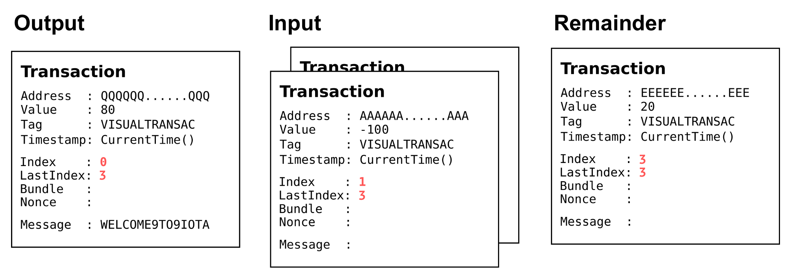

# Bundles and transactions

**Each transaction is either an input or an output. To transfer IOTA tokens, you need both input and outputs transactions, which are grouped together in a bundle.**

Bundles are atomic, meaning that the fate of each transaction in a bundle depends on the rest. Either all transactions are valid or none of them are.

When you create a bundle, each transaction is given a `currentIndex` number and connected to each other through the [`trunkTransaction` field](../references/structure-of-a-transaction.md).

After you send the bundle to an [IRI node](root://iri/0.1/introduction/overview.md), each transaction is validated and appended to the ledger.

During tip selection, an IRI node finds and [validates each transaction in your bundle](root://iri/0.1/concepts/transaction-validation.md#bundle-validator) by traversing the `trunkTransaction` field. When the IRI node validates all transactions up to the [`lastIndex` field](../references/structure-of-a-transaction.md), your bundle is considered valid and one of the transactions is selected as a tip transaction to be referenced by another transaction.

## Input and output transactions

A bundle can consist of any number of input and output transactions. We recommend a maximum of 30 transactions in a bundle.

### Input transaction

Input transactions debit IOTA tokens from addresses. Bundles can contain multiple input transactions. However, each input transaction must be signed. The length of the signature depends on the [security level](../concepts/addresses-and-signatures#how-addresses-are-generated) of the address.

**Important:** Addresses must not be spent from more than once. Therefore, input transactions must debit all IOTA tokens from an address even if the sender does not want to transfer all of them to the recipient. The remaining IOTA tokens can be transferred to another address (usually the sender's address) in an output transaction.

### Output transaction

An output transaction can be one of the following:

* A zero-value transactions that contains only a message in the `signatureMessageFragment` field
* A transaction with a positive value that credits IOTA tokens to an address

Transactions that credit IOTA tokens can also contain a message.

Output transactions do not debit IOTA tokens and therefore do not need to be signed.

## Example of a bundle that transfers IOTA tokens

This bundle transfers 80 IOTA tokens to a recipient from an address with a security level of 2.

| Transaction index | Transaction contents                                                     | Value                                          |
| ----- | ------------------------------------------------------------------------- | --------------------------------------------------------------- |
| 0     | Recipient's address                       | 80 (sent to the recipient's address)                    |
| 1     | Sender's address, and the first part of the signature | -100 (the total balance of the sender's address as a negative value) |
| 2     | Sender's address, and the second half of the signature.                                         | 0                                                               |
| 3     | An address for the transfer of the remaining IOTA tokens (usually one of the sender's addresses).                              | 20 (Remainder of the sender's address in transaction 1)                          |

