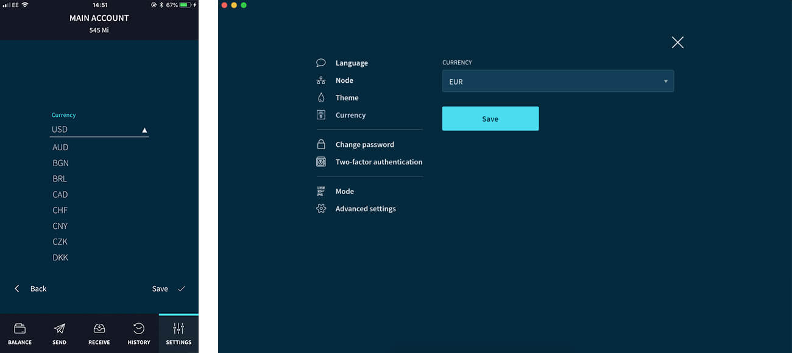
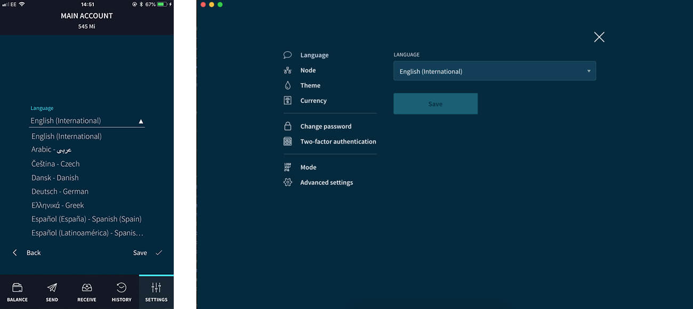

# Change the general settings

**General settings change elements of the user interface in Trinity. Change the general settings to customize the user interface.**

In Trinity, go to **Settings** to customize general settings. 

## Change the user mode

Trinity has two modes:
* **Standard mode:** Displays only the most relevant information for standard users
* **Advanced mode:** Displays technical information, such as error logs, for advanced users

## Change the theme

Trinity has many themes to choose from. Each one changes how the application looks. 

## Change the currency converter

The current value of the token is displayed in the currency that is selected in this setting.

## Change the display language

Trinity has been translated into different languages. Select one to change the language that's displayed.

### Connect to a custom node

Trinity provides a built-in node-balancing service for optimal performance. Every time you open your wallet, Trinity selects a healthy node with a low load.

You may want to select a custom node to connect to. For example, if you run your own IRI node.

To do so, go to **Settings** > **Node**, and enter the URL or IP address of an IRI node.
