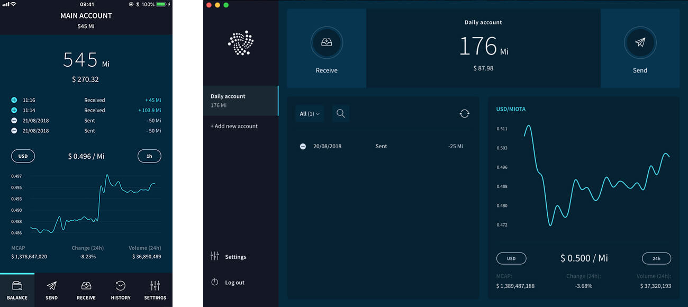

# Trinity overview

**Trinity is a mobile and desktop application with a user interface that allows you to transfer data and IOTA tokens on the IOTA Mainnet network.**

Trinity allows you to do the following:
* Create a password-protected account to store and access your seeds
* Read your balance and transaction history
* Send and receive transactions on the [IOTA MainNet network](/getting-started/references/iota-networks.md)

 

## Security

To use Trinity, you must enter your seed, which holds the keys to all your addresses. Therefore, to ensure the security of your funds, Trinity has been audited multiple times by external parties.

If you find a vulnerability and you report it to us, you'll receive a monetary reward through our [bug bounty](https://bugcrowd.com/iota). For more information, see [Trinity Bug Bounty](https://blog.iota.org/trinity-public-bug-bounty-df9d2512e50).

## Limitations

Trinity is a platform on which developers can build their own features. Although you can't use Trinity to buy IOTA tokens from an exchange for example, this feature could be developed by an interested third party.

Trinity mobile does not support background processes. If you navigate to another app while an action (for example, logging in, sending transactions, and refreshing your balance) is ongoing, that action **won't** be completed.

