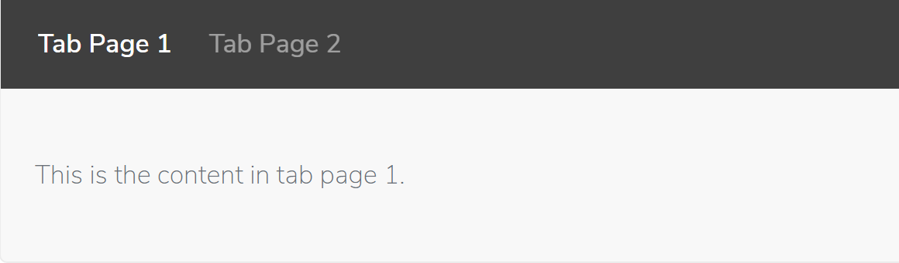
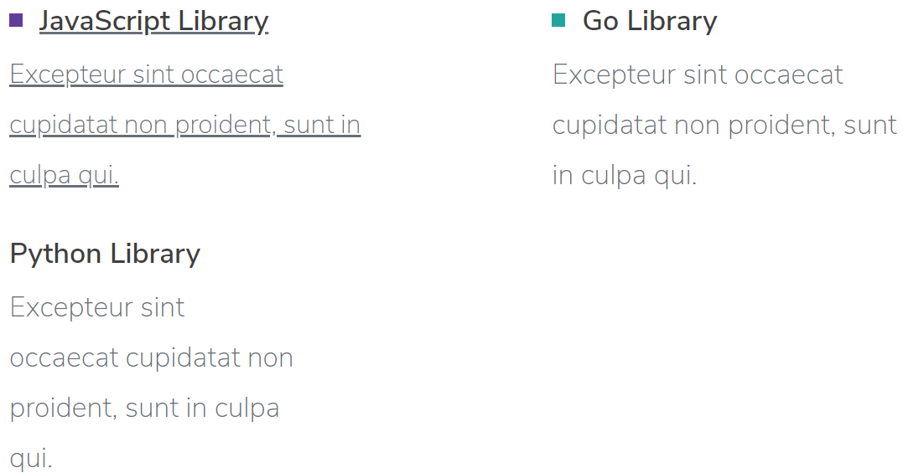

# IOTA Documentation

The IOTA documentation uses an enhanced version of Markdown for its content.

Basic formatting for your Markdown documents can be found here <https://github.com/adam-p/markdown-here/wiki/Markdown-Cheatsheet>

## Enhanced Syntax

In addition to the basic Markdown syntax the documentation also supports some additional markup. The markup is intended to still look sensible when displayed by a markup reader which doesn't support the additional syntax.

### Tabbed Control

The tabbed control is fenced by a horizontal separator with 20 hyphens. The individual tabs require a regular 3 hyphen horizontal separator between them. The title of the tab is read from the level 3 header.

```markup
--------------------
### Tab Page 1
This is the content in tab page 1.
---
### Tab Page 2
This is the content in tab page 2.
--------------------
```

The above markup will produce the following output:



### Heading Label

The heading label is formatted in a similar way to regular level 3 headings except that you also append 3 hashes as well. It can be colored as either primary or secondary by using the ** or __ wrappers around the content.

```markup
### **OFFICIAL SUPPORT** ###

### __COMMUNITY SUPPORT__ ###
```

The above markup will produce the following output:


### Project Topics

Project topics also require fencing with a 15 hyphen horizontal separator. The individual project topics require a regular 3 hyphen horizontal separator between them.
The headings for the project topics are read from the level 4 header.
You can add colored bullets to the heading by wrapping the header in ** for primary and __ for secondary. An optional link can be added which will make the whole project topic linked to that url. The rest of the content is the subheader.

```markup
---------------
#### **JavaScript Library** ####
[Link](./1.0/library/JavaScript)

Excepteur sint occaecat cupidatat non proident, sunt in culpa qui.
---
#### __Go Library__ ####
Excepteur sint occaecat cupidatat non proident, sunt in culpa qui.
---
#### Python Library ####
Excepteur sint occaecat cupidatat non proident, sunt in culpa qui.
---------------
```

The above markup will produce the following output:



### Emojis

To embed emojis in your content add the emoji name you want surrounded by colons.

The names of available emojis can be found here [https://github.com/muan/emojilib/blob/master/emojis.json](https://github.com/muan/emojilib/blob/master/emojis.json)

```markup
:smile:
:laughing:
```

The above markup will produce the following output:

